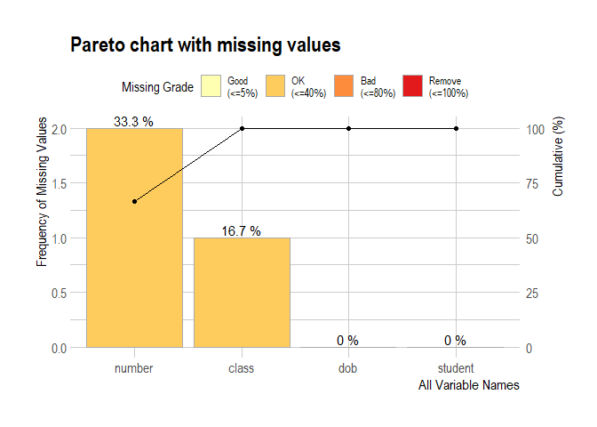
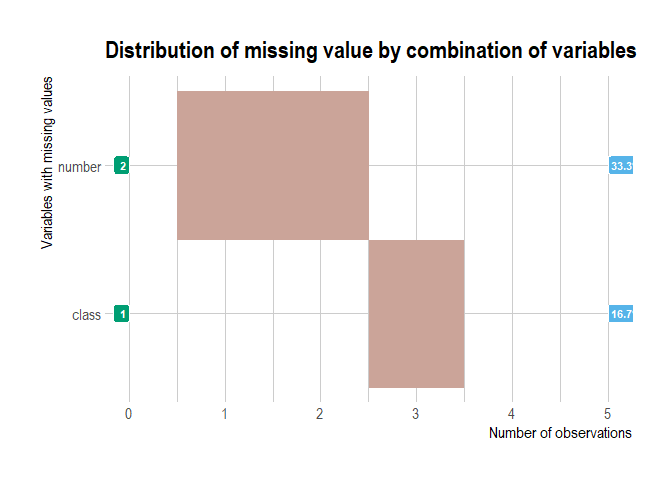
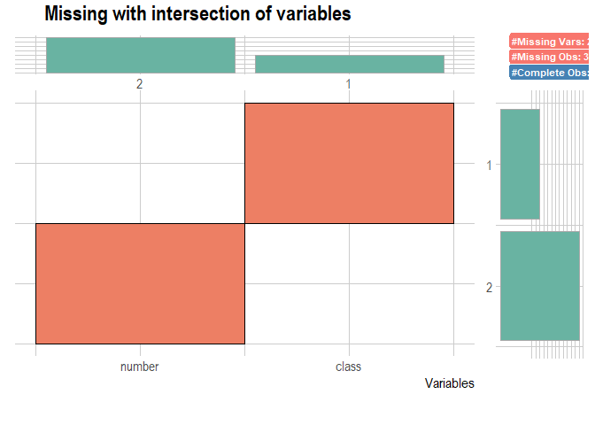

Assessing Data Quality
================
Kathryn Reynolds
07/06/2021

``` r
##Create model dataset with 6 students, student numbers, class names and date of births.
student<-c("a", "b", "c", "d", "e", "f")
number<-c(1, 2, NA, 4, NA, 6)
class<-c("robins", "wrens" , "chaffinches", NA, "sparrows", "kingfishers")
dob<-c("1998-04-06", "1997-11-09", "1998-01-01", "1992-10-12", "1999-06-06", "1998-05-06")


df<-data.frame(student, number, class, dob)
```

# Skimr

This package can help you profile your data at a high level very
quickly. Documentation for the package can be found at this link
[here](https://docs.ropensci.org/skimr/). A tutorial for using this
package can be found at this link
[here](https://www.youtube.com/watch?app=desktop&v=x23Lrn8smHk).

``` r
## Use the Skim package to give you a diagnostic report

skim(df)
```

<table style='width: auto;'
        class='table table-condensed'>

<caption>

Data summary

</caption>

<thead>

<tr>

<th style="text-align:left;">

</th>

<th style="text-align:left;">

</th>

</tr>

</thead>

<tbody>

<tr>

<td style="text-align:left;">

Name

</td>

<td style="text-align:left;">

df

</td>

</tr>

<tr>

<td style="text-align:left;">

Number of rows

</td>

<td style="text-align:left;">

6

</td>

</tr>

<tr>

<td style="text-align:left;">

Number of columns

</td>

<td style="text-align:left;">

4

</td>

</tr>

<tr>

<td style="text-align:left;">

\_\_\_\_\_\_\_\_\_\_\_\_\_\_\_\_\_\_\_\_\_\_\_

</td>

<td style="text-align:left;">

</td>

</tr>

<tr>

<td style="text-align:left;">

Column type frequency:

</td>

<td style="text-align:left;">

</td>

</tr>

<tr>

<td style="text-align:left;">

character

</td>

<td style="text-align:left;">

3

</td>

</tr>

<tr>

<td style="text-align:left;">

numeric

</td>

<td style="text-align:left;">

1

</td>

</tr>

<tr>

<td style="text-align:left;">

\_\_\_\_\_\_\_\_\_\_\_\_\_\_\_\_\_\_\_\_\_\_\_\_

</td>

<td style="text-align:left;">

</td>

</tr>

<tr>

<td style="text-align:left;">

Group variables

</td>

<td style="text-align:left;">

None

</td>

</tr>

</tbody>

</table>

**Variable type: character**

<table>

<thead>

<tr>

<th style="text-align:left;">

skim\_variable

</th>

<th style="text-align:right;">

n\_missing

</th>

<th style="text-align:right;">

complete\_rate

</th>

<th style="text-align:right;">

min

</th>

<th style="text-align:right;">

max

</th>

<th style="text-align:right;">

empty

</th>

<th style="text-align:right;">

n\_unique

</th>

<th style="text-align:right;">

whitespace

</th>

</tr>

</thead>

<tbody>

<tr>

<td style="text-align:left;">

student

</td>

<td style="text-align:right;">

0

</td>

<td style="text-align:right;">

1.00

</td>

<td style="text-align:right;">

1

</td>

<td style="text-align:right;">

1

</td>

<td style="text-align:right;">

0

</td>

<td style="text-align:right;">

6

</td>

<td style="text-align:right;">

0

</td>

</tr>

<tr>

<td style="text-align:left;">

class

</td>

<td style="text-align:right;">

1

</td>

<td style="text-align:right;">

0.83

</td>

<td style="text-align:right;">

5

</td>

<td style="text-align:right;">

11

</td>

<td style="text-align:right;">

0

</td>

<td style="text-align:right;">

5

</td>

<td style="text-align:right;">

0

</td>

</tr>

<tr>

<td style="text-align:left;">

dob

</td>

<td style="text-align:right;">

0

</td>

<td style="text-align:right;">

1.00

</td>

<td style="text-align:right;">

10

</td>

<td style="text-align:right;">

10

</td>

<td style="text-align:right;">

0

</td>

<td style="text-align:right;">

6

</td>

<td style="text-align:right;">

0

</td>

</tr>

</tbody>

</table>

**Variable type: numeric**

<table>

<thead>

<tr>

<th style="text-align:left;">

skim\_variable

</th>

<th style="text-align:right;">

n\_missing

</th>

<th style="text-align:right;">

complete\_rate

</th>

<th style="text-align:right;">

mean

</th>

<th style="text-align:right;">

sd

</th>

<th style="text-align:right;">

p0

</th>

<th style="text-align:right;">

p25

</th>

<th style="text-align:right;">

p50

</th>

<th style="text-align:right;">

p75

</th>

<th style="text-align:right;">

p100

</th>

<th style="text-align:left;">

hist

</th>

</tr>

</thead>

<tbody>

<tr>

<td style="text-align:left;">

number

</td>

<td style="text-align:right;">

2

</td>

<td style="text-align:right;">

0.67

</td>

<td style="text-align:right;">

3.25

</td>

<td style="text-align:right;">

2.22

</td>

<td style="text-align:right;">

1

</td>

<td style="text-align:right;">

1.75

</td>

<td style="text-align:right;">

3

</td>

<td style="text-align:right;">

4.5

</td>

<td style="text-align:right;">

6

</td>

<td style="text-align:left;">

\<U+2587\>\<U+2581\>\<U+2583\>\<U+2581\>\<U+2583\>

</td>

</tr>

</tbody>

</table>

<br> <br>

### Determining the DAMA Dimensions from the above output

**Completeness**: n\_missing and completeness in your report will tell
you how many data points are missing in the dataset you have. You may
want to compare your dataset with one of known completeness to ensure
there are no missing records.

**Uniqueness**: n\_unique will show you how many unique values there are
in your data.

**Validity**: the report will give you a summary of the number of data
types and the format they are in, as well as min and max values per
variable. You should check that they conform to the standards you expect
and need.

**Timeliness**: you may have a date inputted variable which tells you
when this data point was added; min and max will be able to tell you the
range and latest date of this (N.B. make sure this is formatted as a
date). You will then combine this with information you have about the
analysis you want to do, to decide whether it has been updated within
the time you need to get the output you want. If the data points are not
linked to a date, you will hopefully have metadata which contains the
last date updated of the data. If you have not had this information
provided to you here, you will need to speak to the source of the data
to find out when it was last updated, and whether they have any policies
about when this should be.

**Accuracy**: for numeric values, the report will give you the sd
(standard deviation) and a small histogram of the values to give you a
small snapshot of variance within your dataset. You may need to do more
in depth analysis to determine accuracy.

**Consistency**: R will default to the character format if there is
confusion in the format of the data. More variables in the character
section of your report than you expected may highlight inconsistencies
in the recording of that variable and you may need to do a deeper dive
to identify the issues. To compare consistency with other datasets you
need to use, you can use the joining functions in tidyverse (explained
here) and re-run the skim command.

# dlookr

This package can provide more detailed quality information than skimr.
The overview(df) report will provide you with a basic overview of data
which will tell you some information about completeness and uniqueness.
There are many more functions which will help you to diagnose, explore
and transform the quality of your data within this package across the
dimensions. The documentation for this can be found at [this link
here](https://choonghyunryu.github.io/dlookr/articles/introduce.html#preface).
A tutorial for using dlookr can be found at [this link
here](https://www.youtube.com/watch?v=M7eNYbd4n1Y).

``` r
overview(df)
```

    ##     division        metrics value
    ## 1       size   observations     6
    ## 2       size      variables     4
    ## 3       size         values    24
    ## 4       size    memory_size  2304
    ## 5    missing   complete_obs     3
    ## 6    missing    missing_obs     3
    ## 7    missing   missing_vars     2
    ## 8    missing missing_values     3
    ## 9  data_type       numerics     1
    ## 10 data_type       integers     0
    ## 11 data_type        factors     0
    ## 12 data_type     characters     3
    ## 13 data_type         others     0

``` r
diagnose(df)
```

    ## # A tibble: 4 x 6
    ##   variables types     missing_count missing_percent unique_count unique_rate
    ##   <chr>     <chr>             <int>           <dbl>        <int>       <dbl>
    ## 1 student   character             0             0              6       1    
    ## 2 number    numeric               2            33.3            5       0.833
    ## 3 class     character             1            16.7            6       1    
    ## 4 dob       character             0             0              6       1

**Completeness**

``` r
diagnose(df)
```

    ## # A tibble: 4 x 6
    ##   variables types     missing_count missing_percent unique_count unique_rate
    ##   <chr>     <chr>             <int>           <dbl>        <int>       <dbl>
    ## 1 student   character             0             0              6       1    
    ## 2 number    numeric               2            33.3            5       0.833
    ## 3 class     character             1            16.7            6       1    
    ## 4 dob       character             0             0              6       1

``` r
plot_na_pareto(df)
```

<!-- -->

``` r
plot_na_hclust(df)
```

<!-- -->

``` r
plot_na_intersect(df)   
```

<!-- -->

**Uniqueness**

``` r
diagnose(df)
```

    ## # A tibble: 4 x 6
    ##   variables types     missing_count missing_percent unique_count unique_rate
    ##   <chr>     <chr>             <int>           <dbl>        <int>       <dbl>
    ## 1 student   character             0             0              6       1    
    ## 2 number    numeric               2            33.3            5       0.833
    ## 3 class     character             1            16.7            6       1    
    ## 4 dob       character             0             0              6       1

**Validity**

``` r
diagnose(df)
```

    ## # A tibble: 4 x 6
    ##   variables types     missing_count missing_percent unique_count unique_rate
    ##   <chr>     <chr>             <int>           <dbl>        <int>       <dbl>
    ## 1 student   character             0             0              6       1    
    ## 2 number    numeric               2            33.3            5       0.833
    ## 3 class     character             1            16.7            6       1    
    ## 4 dob       character             0             0              6       1

This will tell you the types of the data you have in your dataset. We
can see here that date of birth (dob) is listed as a character, not a
date. We want to correct this.

``` r
df$dob<-as.Date(df$dob)

diagnose(df)
```

    ## # A tibble: 4 x 6
    ##   variables types     missing_count missing_percent unique_count unique_rate
    ##   <chr>     <chr>             <int>           <dbl>        <int>       <dbl>
    ## 1 student   character             0             0              6       1    
    ## 2 number    numeric               2            33.3            5       0.833
    ## 3 class     character             1            16.7            6       1    
    ## 4 dob       Date                  0             0              6       1

Now the dob is in the correct format.

``` r
diagnose_category(df)
```

    ## # A tibble: 12 x 6
    ##    variables levels          N  freq ratio  rank
    ##    <chr>     <chr>       <int> <int> <dbl> <int>
    ##  1 student   a               6     1  16.7     1
    ##  2 student   b               6     1  16.7     1
    ##  3 student   c               6     1  16.7     1
    ##  4 student   d               6     1  16.7     1
    ##  5 student   e               6     1  16.7     1
    ##  6 student   f               6     1  16.7     1
    ##  7 class     chaffinches     6     1  16.7     1
    ##  8 class     kingfishers     6     1  16.7     1
    ##  9 class     robins          6     1  16.7     1
    ## 10 class     sparrows        6     1  16.7     1
    ## 11 class     wrens           6     1  16.7     1
    ## 12 class     NA              6     1  16.7     1

``` r
diagnose_numeric(df)
```

    ## # A tibble: 1 x 10
    ##   variables   min    Q1  mean median    Q3   max  zero minus outlier
    ##   <chr>     <dbl> <dbl> <dbl>  <dbl> <dbl> <dbl> <int> <int>   <int>
    ## 1 number        1  1.75  3.25      3   4.5     6     0     0       0

``` r
diagnose_outlier(df)
```

    ##   variables outliers_cnt outliers_ratio outliers_mean with_mean without_mean
    ## 1    number            0              0           NaN      3.25         3.25
